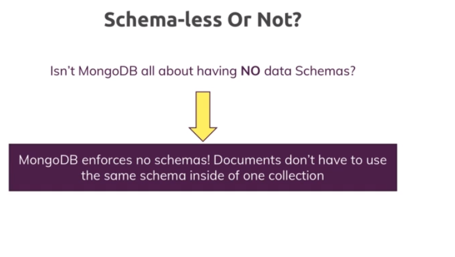

# 3-Schemas-Relations

1. [Resseting your Database](#schema1)
2. [Why do we you use schemas?](#schema2)
3. [Structuring Documents](#schema3)
4. [Data Types](#schema4)
5. [Undestanding Relations](#schema5)
6. [Example Exercise](#schema6)

<hr>

<a name="schema1"></a>

## 1. Resseting your Database

- Eliminar una base de datos

```
use databaseName
db.dropDatabase()
```
- Eliminar una colección
```

db.mycollection.drop()
```


<hr>

<a name="schema2"></a>

## 2. Why do we you use schemas?





Documentos con diferentes schemas

```
shop> db.products.find()
[
  {
    _id: ObjectId('6560910f908c91a7cd6a8ada'),
    name: 'A book',
    price: 12.99
  },
  {
    _id: ObjectId('6560917f908c91a7cd6a8adb'),
    title: 'T-shirt',
    seller: { name: 'Max', age: 29 }
  }

```


<hr>

<a name="schema3"></a>

## 3. Structuring Documents


- Diferentes eschemas
```
shop> db.products.find()
[
  {
    _id: ObjectId('656093a9908c91a7cd6a8adc'),
    name: 'A book',
    price: 12.99
  },
  {
    _id: ObjectId('656093cd908c91a7cd6a8add'),
    name: 'a T-shirt',
    price: 15
  },
  {
    _id: ObjectId('65609463908c91a7cd6a8ade'),
    name: 'A Computer',
    price: 1299,
    details: { cpu: 'Intel i7 8770' }
  }
]

```
- Esquemas iguales
```
[
  {
    _id: ObjectId('6560955e908c91a7cd6a8adf'),
    name: 'a T-shirt',
    price: 15,
    details: null
  },
  {
    _id: ObjectId('6560956c908c91a7cd6a8ae0'),
    name: 'A book',
    price: 12.99,
    details: null
  },
  {
    _id: ObjectId('6560957e908c91a7cd6a8ae1'),
    name: 'A Computer',
    price: 1299,
    details: { cpu: 'Intel i7 8770' }
  }
]
```

En MongoDB, a diferencia de las bases de datos relacionales, no se define un esquema estricto para las colecciones. 
MongoDB es una base de datos NoSQL orientada a documentos, lo que significa que los documentos en una colección 
pueden tener estructuras diferentes.

Sin embargo, aunque MongoDB es conocido por su esquema dinámico, en la práctica, a menudo es beneficioso establecer 
ciertas convenciones o acuerdos sobre la estructura de tus documentos para garantizar la coherencia y facilitar la 
consulta y el mantenimiento de los datos. Esto se llama "esquema implícito" o "esquema flexible".


<hr>

<a name="schema4"></a>

## 4. Data Types


Ejemplo

```
companyData> db.companies.find()
[
  {
    _id: ObjectId('6560a511908c91a7cd6a8ae2'),
    name: 'Fresh Apples Inc',
    isStartup: true,
    employess: 33,
    funding: 12345678900123458000,
    details: { ceo: 'Mark Super' },
    tags: [ { title: 'super' }, { title: 'perfect' } ],
    foundingDate: ISODate('2023-11-24T13:28:49.495Z'),
    insertAt: Timestamp({ t: 1700832529, i: 1 })
  }
]

```


<hr>

<a name="schema5"></a>

## 5. Undestanding Relations


 ### One to One Relations - Embedded
 
- Creamos la base de datos `hospital`
```
test> use hospital
switched to db hospital
```
- Creamos la colección  `patients`  con el primer paciente.
```
hospital> db.patients.insertOne({name:'Max',age:29,diseaseSummary:"summary-max-a"})
{
  acknowledged: true,
  insertedId: ObjectId('65645f1f98a22cd4957ce658')
}
```
- Creamos una segunda coleccion `summary-max-1`
```
hospital> db.diseaseSummaries.insertOne({_id:"summary-max-a",diseases:['cold','broken leg']})
{ acknowledged: true, insertedId: 'summary-max-a' }
```
- Nuestra app necesita tener todos los datos del paciente.
- 1º Localizar el paciente:
```
hospital> db.patients.find({ name: 'Max' }).forEach(function (patient) { print(patient.diseaseSummary); });
summary-max-a
```
- 2º Guardamos el valor de `diseaseSummary`
```
var dsid = db.patients.findOne().diseaseSummary
```
- 3º Obtenemos de la otra colección los valores deseados
```
hospital> db.diseaseSummaries.findOne({_id:dsid})
{ _id: 'summary-max-a', diseases: [ 'cold', 'broken leg' ] }
```

Esto no es buena manera de trabajar, vamos a ver esto con relacions 1 a 1.
```
db.patients.insertOne({name:'Max',age:29,diseaseSummary:{diseases:['cold','broken leg']}})
hospital> db.patients.findOne()
{
  _id: ObjectId('65646854404a9eb424ecebc2'),
  name: 'Max',
  age: 29,
  diseaseSummary: { diseases: [ 'cold', 'broken leg' ] }
}
```
### One to One - Using References

- Creamos una nueva base de datos
```
test> use carData
switched to db carData
carData> db.persons.insertOne({name:'Max', age:29, salary:3000})
{
  acknowledged: true,
  insertedId: ObjectId('65647a56fe3f6890e9eceb49')
}

db.persons.findOne()
{
  _id: ObjectId('65647be3fe3f6890e9eceb4a'),
  name: 'Max',
  age: 29,
  salary: 3000
}
```
- Hacemos la referencia por medio del `ObjectId ` 
```
carData> db.cars.insertOne({model:'BMW', price:40000, owner:ObjectId('65647be3fe3f6890e9eceb4a')})
{
  acknowledged: true,
  insertedId: ObjectId('65648375fe3f6890e9eceb4b')
}

```
### One to Many - Embedded


- Creamos la base de datos y las colecciones necesarias
```
support> db.questionThreads.insertOne({creator:'Max',question:'How does that all work?',answers:['q1d1','q1d2']})
{
  acknowledged: true,
  insertedId: ObjectId('656485c5fe3f6890e9eceb4c')
}
db.answers.insertMany([{_id:'q1d1', text:'It works like that.'}, {_id:'q1d2', text:'Thanks!'}])
{ acknowledged: true, insertedIds: { '0': 'q1d1', '1': 'q1d2' } }
support> db.answers.find()
[
  { _id: 'q1d1', text: 'It works like that.' },
  { _id: 'q1d2', text: 'Thanks!' }

```
- Mejor solución
```
support> db.questionThreads.insertOne({creator:'Max',question:'How does that all work?',answers:[{text:'like that.'},{text:'Thanks'}]})
{
  acknowledged: true,
  insertedId: ObjectId('65648775fe3f6890e9eceb4d')
}
support> db.questionThreads.findOne()
{
  _id: ObjectId('65648775fe3f6890e9eceb4d'),
  creator: 'Max',
  question: 'How does that all work?',
  answers: [ { text: 'like that.' }, { text: 'Thanks' } ]
}
```
### One To Many - Using References

Usamos el `ObjectId`

```
cityData> db.cities.findOne()
{
  _id: ObjectId('65648959fe3f6890e9eceb4e'),
  name: 'New York City',
  coordinates: { lat: 21, lng: 55 }
}

cityData> db.citiezens.find()
[
  {
    _id: ObjectId('65648a4ffe3f6890e9eceb4f'),
    name: 'Max',
    cityId: ObjectId('65648959fe3f6890e9eceb4e')
  },
  {
    _id: ObjectId('65648a4ffe3f6890e9eceb50'),
    name: 'Manuel',
    cityId: ObjectId('65648959fe3f6890e9eceb4e')
  }
]
```
### Many to Many - Embedded

```
shop> db.products.findOne()
{
  _id: ObjectId('65648b4cfe3f6890e9eceb51'),
  title: 'A book',
  price: 12.99
}
db.customers.findOne()
{ _id: ObjectId('65648b67fe3f6890e9eceb52'), name: 'Max', age: 29 }
 db.orders.findOne()
{
  _id: ObjectId('65648c6ffe3f6890e9eceb54'),
  productID: ObjectId('65648b4cfe3f6890e9eceb51'),
  customerId: ObjectId('65648b67fe3f6890e9eceb52')
}

```
### Many to Many - Using References

```
bookRegistry> db.books.insertOne({name: 'My favorite Book', authors: [{name:'Max',age:29},{name:'Manuel',age:30}]})
{
  acknowledged: true,
  insertedId: ObjectId('6564a438fe3f6890e9eceb55')
}
bookRegistry> db.books.find()
[
  {
    _id: ObjectId('6564a438fe3f6890e9eceb55'),
    name: 'My favorite Book',
    authors: [ { name: 'Max', age: 29 }, { name: 'Manuel', age: 30 } ]
  }
]

bookRegistry> db.authors.insertMany([{name:'Max', age:29,address:{street:'Mi calle' }},{name:'Manuel',age:30,address:{street:'Su calle'}}])
{
  acknowledged: true,
  insertedIds: {
    '0': ObjectId('6564a4ecfe3f6890e9eceb56'),
    '1': ObjectId('6564a4ecfe3f6890e9eceb57')
  }
}
bookRegistry> db.authors.find()
[
  {
    _id: ObjectId('6564a4ecfe3f6890e9eceb56'),
    name: 'Max',
    age: 29,
    address: { street: 'Mi calle' }
  },
  {
    _id: ObjectId('6564a4ecfe3f6890e9eceb57'),
    name: 'Manuel',
    age: 30,
    address: { street: 'Su calle' }
  }
]

```
Cambiamos la colección `books`, porque tenemos valores duplicados, nombre del autor y edad. Ponemos la referencia a 
cada autor.

```
bookRegistry> db.books.updateOne({},{$set:{authors:[ObjectId('6564a4ecfe3f6890e9eceb56'),ObjectId('6564a4ecfe3f6890e9eceb57')]}})
{
  acknowledged: true,
  insertedId: null,
  matchedCount: 1,
  modifiedCount: 0,
  upsertedCount: 0
}
bookRegistry> db.books.find()
[
  {
    _id: ObjectId('6564a438fe3f6890e9eceb55'),
    name: 'My favorite Book',
    authors: [
      ObjectId('6564a4ecfe3f6890e9eceb56'),
      ObjectId('6564a4ecfe3f6890e9eceb57')
    ]
  }
]

```

## Summarizing Relations


### Using `lookUp()` for merging References Relations

```
bookRegistry> db.books.aggregate([{$lookup:{from: "authors", localField:'authors',foreignField:'_id',as:'creators'}}])
[
  {
    _id: ObjectId('6564a438fe3f6890e9eceb55'),
    name: 'My favorite Book',
    authors: [
      ObjectId('6564a4ecfe3f6890e9eceb56'),
      ObjectId('6564a4ecfe3f6890e9eceb57')
    ],
    creators: [
      {
        _id: ObjectId('6564a4ecfe3f6890e9eceb56'),
        name: 'Max',
        age: 29,
        address: { street: 'Mi calle' }
      },
      {
        _id: ObjectId('6564a4ecfe3f6890e9eceb57'),
        name: 'Manuel',
        age: 30,
        address: { street: 'Su calle' }
      }
    ]
  }
]

```
Lo que antes teníamos en dos colecciones, ahora tenemos en la colección de `books` también lo que hay en la colección 
de `authors`

<hr>

<a name="schema6"></a>

## 6. Example Exercise